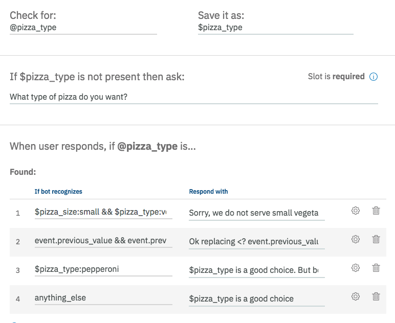
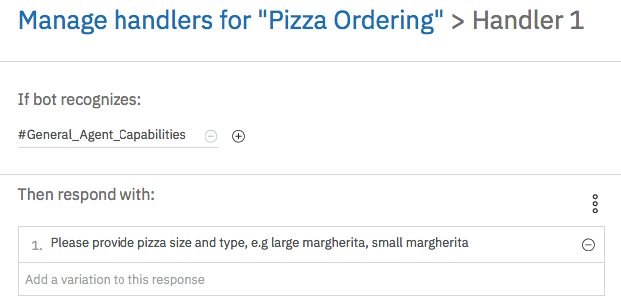

{width="4.72in"
height="4.66in"}

**Lab Instructions**

Laurent Vincent

**Content**

[TOC]

Let's get started
=================

### Overview

The [IBM Watson Developer
Cloud](http://www.ibm.com/smarterplanet/us/en/ibmwatson/developercloud/)
(WDC) offers a variety of services for developing cognitive
applications. Each Watson service provides a Representational State
Transfer (REST) Application Programming Interface (API) for interacting
with the service. Some services, such as the Speech to Text service,
provide additional interfaces.

The [Watson
Assistant](http://www.ibm.com/watson/developercloud/conversation.html)
service combines several cognitive techniques to help you build and
train a bot - defining intents and entities and crafting dialog to
simulate conversation. The system can then be further refined with
supplementary technologies to make the system more human-like or to give
it a higher chance of returning the right answer. Watson Conversation
allows you to deploy a range of bots via many channels, from simple,
narrowly focused bots to much more sophisticated, full-blown virtual
agents across mobile devices, messaging platforms like Slack, or even
through a physical robot.

The **illustrating screenshots** provided in this lab guide could be
slightly different from what you see in the Watson Assistant service
interface that you are using. If there are colour or wording
differences, it is because there have been updates to the service since
the lab guide was created.

### Objectives

Watson Conversation Service provides several options to manage
Conditions, and possibility to have several answers to make your bot
more human.

In this lab, you will:

-   Learn how to use IBM Cloud Function from the dialog

-   Gather information with Slots

### Prerequisites

Before you start the exercises in this guide, you will need to complete
the following prerequisite tasks:

-   Lab 2 part 1 -- building a dialog lab Instructions

-   The instructor provided you the link to get labs content. **You may
    download each file individually.**

    Reminder of IBM Cloud URLs per location:

  **Location**   **URL**
  -------------- ---------------------------------
  worldwide      **https://cloud.ibm.com/login**

### Scenario

**Use case**: A Hotel Concierge Virtual assistant that is accessed from
the guest room and the hotel lobby.

**End-users**: Hotel customers

### What to expect when you are done

At the end of session, you should get a more complex dialog using
several conditions and answer in the same node.

{width="4.731481846019247in"
height="7.482343613298338in"}

Gathering information with Slots
================================

To gather information, you have created a branch, now you can use Slots
to do it and simplify your dialog.

You can think of slots as the chatbot version of a web form in which
users must fill out required fields before they can submit the form.
Similarly, slots prevent the flow of conversation from moving on to a
new subject until the required values are provided

You are going to build a chatbot to order pizza. To do it, the chatbot
must gather the size and the type of your pizza. We assume that your
hotel can deliver such a service.

### Bot Control precreated intents.

At the end of the acquisition of all information, we are going to
request a validation of the order. To do this we are using 2 existing
intents *\#Bot\_Control\_Approve\_Response* and
*\#Bot\_control\_reject\_Response*.

1.  Go back to **Content Catalog** tab

2.  On *Bot Control* row, Click Add to skill

{width="6.737728565179353in"
height="1.6261679790026247in"}

**\
**

### Add Pizza Ordering node and slots

The best should be to create a node to manage any orders, we will
simplify the lab and order only pizza which can be delivered in the
guestroom.

1.  Go back to Dialog page

2.  Add a node below **Find a restaurant** **branch** or **Greeting**
    node

    {width="4.149531933508311in"
    height="1.6993766404199475in"}

3.  Set *\#order\_pizza* as condition and *Pizza Ordering* as name

4.  Click **Customize**

    {width="5.669699256342957in"
    height="1.5010247156605425in"}

5.  Switch **Slots** on and enable **Prompt for everything**

{width="3.534882983377078in"
height="3.400462598425197in"}

6.  Click **Apply**

7.  At the bottom of the edit page click **Add slot** 2 times

8.  Fill the slots like these

  **Check for**                                                               **Save it as**          **If not present, ask**
  --------------------------------------------------------------------------- ----------------------- -----------------------------------------------------------------------------
  *\@pizza\_size*                                                             *\$pizza\_size*         *What size of pizza do you want?*
  *\@pizza\_type*                                                             *\$pizza\_type*         *What type of pizza do you want?*
  *\@pizza\_toppings.values*                                                  *\$pizza\_toppings*     
  *\@pizza\_notoppings.values*                                                *\$pizza\_notoppings*   
  *\#Bot\_Control\_Approve\_Response \|\| \#Bot\_Control\_Reject\_Response*   *\$pizza\_confirmed*    *I have you for \$pizza\_size \$pizza\_type \$texttoppings. Is it correct?*

9.  In the filed **If no slots are pre-filled, ask this firs**t enter :
    *Can you provide us the pizza size (small, medium, large) and the
    pizza type (vegetarian, mexicana, quatro formaggi, pepperoni,
    margherita)?*

{width="5.83990813648294in"
height="5.810125765529309in"}**\
**

### Manage the basic order information : pizza size

1.  Click **settings/customize/edit slot** icon of the **pizza\_size**
    slot

{width="2.119192913385827in"
height="0.790579615048119in"}

2.  In the configure slot window, click on the 3 dots menu and select
    **enable conditional responses**

    {width="6.263888888888889in"
    height="1.2715277777777778in"}

3.  In **Found** frame, on the first row, click **edit** icon
    {width="0.375in"
    height="0.3194444444444444in"}

4.  Open the context editor. (the 3 dots)

    {width="6.263888888888889in"
    height="3.0097222222222224in"}

5.  Fill the slot 'found" like this

    Condition : *\$pizza\_size:small && \$pizza\_type:vegetarian*

    Context variable : *pizza\_size*

    Context value : *null*

    Respond : *Sorry, we do not serve small vegetarian pizza. Please
    select different type or size.*

> {width="6.292333770778653in"
> height="4.064815179352581in"}

The simplest response example should be just to confirm the size of the
pizza. Here we illustrate the capability to check the provided value
according to some other context variables.

6.  Click **back**

7.  In **Not found** frame, enter the respond:\
    condition: *true*

    response: *Please provide size of the pizza, e.g small, medium or
    large.*

    Below the first slot:

{width="6.263888888888889in"
height="6.521527777777778in"}

8.  Click **Save**

**\
**

### Manage the basic order information : pizza type

1.  Click settings icon of the **pizza\_type** slot

{width="2.119192913385827in"
height="0.790579615048119in"}

9.  In the configure slot window, click on the 3 dots menu and select
    **enable conditional responses**

    {width="2.1207075678040246in"
    height="1.5068186789151357in"}

10. In **Found** frame, on the first row, click **edit** icon
    {width="0.375in"
    height="0.3194444444444444in"}

11. Open the context editor. (the 3 dots)

12. Fill the slot 'found" like this

    Condition : *\$pizza\_size:small && \$pizza\_type:vegetarian*

    Context variable : *pizza\_type*

    Context value : *null*

    Respond : *Sorry, we do not serve small vegetarian pizza. Please
    select different type or size.*

    {width="5.236111111111111in"
    height="2.625in"}

13. Click **back**

<!-- -->

2.  In the Found frame, add 3 more responses and condition like that:

    Resp2 condition: *event.previous\_value and
    event.previous\_value!=event.current\_value*

    Resp2 response: *Ok replacing \<? event.previous\_value ?\> with \<?
    event.current\_value ?\>.*

    Resp3 condition: *\$pizza\_type:pepperoni*

    Resp3 response: *\$pizza\_type is a good choice. But be warned,
    pepperoni is very hot!*

    Resp4 condition: *anything\_else*

    Resp3 response: *\$pizza\_type is a good choice.*

    That's the way to enrich the chatbot responses and make it more
    human like.

    {width="6.263888888888889in"
    height="5.127777777777778in"}

3.  In **Not found** frame, enter the respond:\
    Resp3 condition: *true*\
    Resp3 response: *You can select one of the following types:
    margherita, pepperoni, quatro formaggi, mexicana, vegetarian*

    {width="6.263888888888889in"
    height="2.171527777777778in"}

4.  Click **Save**

**\
**

### Manage the toppings the user would like to add

1.  Click **settings** icon of the **pizza\_toppings** slot

2.  In the configure slot window, click on the 3 dots menu and select
    **enable conditional responses**

3.  In **Found** frame, add 2 responses and condition like that:

    Resp1 condition: *\$pizza\_notoppings && \$pizza\_toppings*

    Resp1 response:

    Resp2 condition: *\$pizza\_toppings*

    Resp2 response:*.*

{width="5.750816929133858in"
height="4.769607392825897in"}

4.  In **Found** frame, Click **Edit** icon for the first condition,
    then open the **Context editor** and fill it like this:

    Resp1 context variable: *texttoppings*

    Resp1 context value: *with \<? \$pizza\_toppings.join(\',\') ?\> and
    without \<? \$pizza\_notoppings.join(\',\') ?\>*

    {width="6.263888888888889in"
    height="3.033333333333333in"}

5.  Click **Back**

6.  In **Found** frame, Click **Edit** icon for the second condition,
    then open the **Context editor** and fill it like this:

    Resp1 context variable: *texttoppings*

    Resp1 context value: *with \<? \$pizza\_toppings.join(\',\') ?\>*

    {width="6.263888888888889in"
    height="2.9833333333333334in"}

7.  Click **Back**

8.  Click **Save**

### Manage the toppings the user would like to remove

1.  Click **settings** icon of the **pizza\_notoppings** slot

2.  In the configure slot window, click on the 3 dots menu and select
    **enable conditional responses**

3.  In **Found** frame, add 2 responses and condition like that:

    Resp1 condition: *\$pizza\_notoppings && \$pizza\_toppings*

    Resp1 response:

    Resp2 condition: *\$pizza\_notoppings*

    Resp2 response:*.*

{width="5.80754593175853in"
height="4.414893919510061in"}

4.  In **Found** frame, Click **Edit** icon for the first condition,
    then open the **Context editor** and fill it like this:

    Resp1 context variable: *texttoppings*

    Resp1 context value: *with \<? \$pizza\_toppings.join(\',\') ?\> and
    without \<? \$pizza\_notoppings.join(\',\') ?\>*

    {width="6.263888888888889in"
    height="3.033333333333333in"}

5.  Click **Back**

6.  In **Found** frame, Click **Edit** icon for the second condition,
    then open the **Context editor** and fill it like this:

    Resp1 context variable: *texttoppings*

    Resp1 context value: *without \<? \$pizza\_notoppings.join(\',\')
    ?\>*

    {width="6.263888888888889in"
    height="3.027083333333333in"}

7.  Click **Back**

8.  Click **Save**

### Manage the confirmation 

9.  Click settings icon of the **pizza\_confirmed** slot

{width="2.119192913385827in"
height="0.790579615048119in"}

10. In the configure slot window, click on the 3 dots menu and select
    **enable conditional responses**

11. In **Found** frame, add 2 responses and condition like that:

    Resp1 condition: *\#Bot\_Control\_Approve\_Response*

    Resp1 response: *Your pizza order will be finished in few minutes.
    Please feel free to place another order right now*

    Resp2 condition: *\#Bot\_Control\_Reject\_Response*

    Resp2 response: *The order has been cancelled.*

{width="6.263888888888889in"
height="5.510416666666667in"}

1.  In **Not found** frame, enter the respond:\
    Resp1 condition: *true\
    *Resp1 response: *Sorry, I did not understand. Can you please write
    yes to confirm the order or no to cancel the order all together? You
    can also yet change the type or size. Just say e.g. \'\"small
    Margherita.*

{width="6.3258552055993in"
height="1.7222222222222223in"}

12. Click **Save**

### Manage Handlers

You can optionally define node-level handlers that provide responses to
questions users might ask during the interaction that are tangential to
the purpose of the node. Right now, the handlers enable users to leave
the order or get some help.

1.  Edit the **Pizza\_ordering** node

2.  Click **Manage handlers**

{width="6.263888888888889in"
height="2.2534722222222223in"}

You are going to add 3 handlers.

3.  Click twice **Add handler**

    **Note:** to open the json editor, you must click on edit icon of
    the selected row then the 3 dots on the new window

4.  Fill the 3 handlers as defined below (for second and third open
    context editor)

    Handler1 condition: *\#General\_Agent\_Capabilities*

    Handler1 response: *Please provide pizza size and type, e.g large
    margherita, small margherita.*

    {width="5.267566710411199in"
    height="2.5531922572178476in"}

    Handler2 condition: *\#reset*

> Handler2 response: *Resetting*

Handler2 Context 1 Variable: *pizza\_size*

Handler2 Context 1 Value: *null*

Handler2 Context 2 Variable: *pizza\_type*

Handler2 Context 2 Value: *null*

{width="5.372341426071741in"
height="3.8157403762029745in"}

Handler3 condition: *\#exit*

> Handler3 response: *exiting*

Handler3 Context 1 Variable: *pizza\_size*

Handler3 Context 1 Value: *\"no\_def\"*

Handler3 Context 2 Variable: *pizza\_type*

Handler3 Context 2 Value: *\"no\_def\"*

Handler3 Context 3 Variable: *pizza\_confirmed*

Handler3 Context 3 Value: *false*

{width="5.347533902012248in"
height="4.159456474190726in"}

Then you should have

{width="6.263888888888889in"
height="2.1930555555555555in"}

5.  Click **Save**

**\
**

### Test your Slots

1.  Open **Try it out** panel and Enter successively:

    *I want to order a pizza\
    pepperoni*

    *A small one*

    *Yes*

    {width="4.059575678040245in"
    height="7.8103204286964125in"}

2.  Click **Clear**

3.  Enter successively

    *I want to order a small vegetarian\
    so, a large one*

    *Yes*

{width="4.1276596675415576in"
height="6.247543744531933in"}

4.  Click **Clear**

5.  Enter successively

    *I want to order a large vegetarian with anchovies and no olive\
    Yes*

{width="4.177310804899387in"
height="4.743203193350831in"}

6.  Click **Clear**

7.  Enter successively

    *I want to order a small pizza\
    stop my order*

{width="3.7222222222222223in"
height="2.991071741032371in"}

If you open the context variable panel, you retrieve the values set by
the handler. The client application has to understand that the command
was cancelled. That's a possibility to stop the slot.

{width="4.861702755905512in"
height="2.555055774278215in"}

You can run some other tests and order a pizza by using your chatbot.

**\
**

Managing nodes and folders
==========================

We can group dialog nodes together by adding them to a folder.

-   It allows a dialog designer to organize content based on topics

-   It is a much easier dialog tree navigation and understanding

-   It allows performing of bulk setting of node settings at the folder
    level instead of one by one

-   It is an easier separation of duties for multiple people working on
    the same bot

Folders have no impact on the order in which nodes are evaluated. But if
a condition is specified, the service first evaluate the folder
conditions to determine whether to process the nodes within it.

The nodes inherit of the digression settings of the folder.

### Add a folder

The best should be to create a node to manage any orders, we will
simplify the lab and order only pizza which can be delivered in the
guestroom.

1.  On the dialog tab, Select **Greeting** node and click **Add folder**

2.  Name it *Hotel Amenities Management*

    We don't apply neither condition nor settings, as we just want to
    organise our dialog.

3.  Move **Hotel Hours** and **Hotel Locations** nodes in it.

    {width="6.6421642607174105in"
    height="2.1782174103237097in"}

    If we make some test the behaviours of the conversation stay the
    same.

Understanding digressions
=========================

Digressions allow for the user to break away from a dialog branch in
order to temporarily change the topic before returning to the original
dialog flow. In this step, you will start to order a pizza, then digress
away to ask for the restaurant\'s hours. After providing the opening
hours information, the service will return back to the pizza ordering
dialog flow.

### Configure your digressions

We are going to configure 2 nodes and 1 folder.

4.  Select **Pizza Ordering** node

5.  Click on **Customize** button then go to the **Digression** tab

    {width="3.6199332895888015in"
    height="4.805555555555555in"}

    This is the default settings :

    Digression cannot go away from this node

    Digression can come into this node

    We want to enable to go away from this node and come into this node

6.  Enable this option go away from this node, don't update the second
    option

    {width="3.4814807524059495in"
    height="4.629629265091864in"}

7.  Click **Apply**

8.  Select **Hotel Amenities management** folder

9.  Click on **Customize** button

    {width="3.3608792650918633in"
    height="2.951014873140857in"}

10. Select the option **Return after digression**

11. Click **Apply**

    The settings will be applied to all nodes into the folder : **Hotel
    Locations** and **Hotel Hours**

    Now, you are going to create **talk to concierge** node which
    requires to not return after digression.

12. Select **talk to concierge** node.

13. Click **Customize**, then go to **Digressions** tab

    We keep the default digression behaviour as we want to be able to
    come into this node without return after digression

    {width="3.9166666666666665in"
    height="2.5555555555555554in"}

14. Select **Intents Confidence rate** node.

15. Click **Customize**, then go to **Digressions** tab

    As this is a technical node, we don't want any digression from or to
    this node. We switch off the option come into this

16. Turn off the second option

    {width="4.688426290463692in"
    height="5.70096019247594in"}

17. Click **Apply**

18. Repeat the previous steps to disable the digression for the
    **Anything else** node.

**\
**

### Test your digressions

1.  Open the **Try is out** panel and click **Clear**

2.  Enter : *I want to order a pizza*

3.  Click on the location Icon (right to the answer)

    {width="3.378018372703412in"
    height="2.012087707786527in"}

    The Pizza Ordering node is highlighted, which was expected/

4.  Enter : *When the hotel restaurant is open?*

    {width="3.3510640857392824in"
    height="2.76754593175853in"}

> The bot digresses away from the **Pizza Ordering** node to process
> the **Hotel Hours**  node. The service then returns to the **Pizza
> Ordering** node, and prompts you again for the size of pizza.

5.  Enter : *ok, I stop my order* to conclude the ordering

6.  Enter : *where is it?* to illustrate that the service kept the
    context.

    {width="3.641383420822397in"
    height="3.287234251968504in"}

7.  Click **Clear**

8.  Enter successively :\
    *I want to order a pizza\
    finally, I want to talk to concierge*

    {width="3.4817279090113735in"
    height="3.9245417760279966in"}

> The bot digresses away from the **Pizza Ordering** node to process
> the T**alk to concierge**  node and not returns to the **Pizza
> Ordering** node.

The final dialog should look like this:

{width="4.7340419947506565in"
height="9.358627515310586in"}
